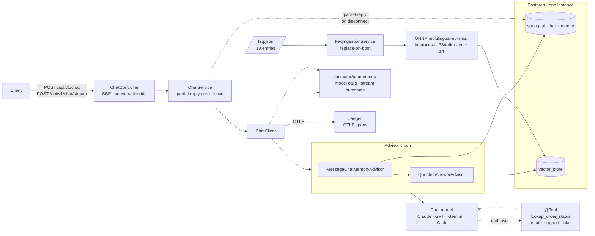
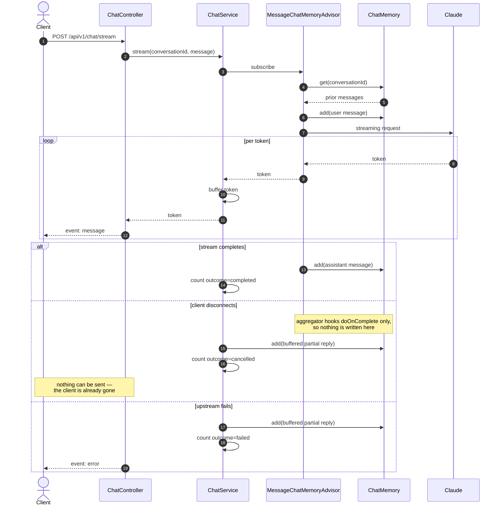

# AI Customer Service System — Java / Spring AI

[](https://github.com/lai3d/ai-customer-service-java/actions/workflows/ci.yml)
[](https://openjdk.org/projects/jdk/21/)
[](https://spring.io/projects/spring-boot)
[](LICENSE)

The Java implementation of an AI customer service backend, built on **Spring Boot 3.5**,
**Spring AI 1.1**, and **Anthropic Claude**, with retrieval-augmented answers over an FAQ corpus, tool calling for real
business actions, SSE streaming, and first-class observability.

This is not a notebook demo. It runs on virtual threads, persists conversation memory and vectors in
the same Postgres instance, exports Prometheus metrics for every model call, and ships with a
Dockerfile and Kubernetes manifests.

> **Status:** Phase 1, under active development. See [Roadmap](#roadmap).

---


*A real exchange, not a mock-up. The second answer combines three things: the delivery date the
`lookup_order_status` tool returned in the previous turn, the returns policy retrieved for this
one, and the conversation memory joining them — "your 30-day window won't start until it's
delivered". The right-hand panel is what a chat widget hides.*

## What this project found


Most of what is worth reading here is a measurement or a mistake, not a feature list.

| | |
| --- | --- |
| A plausible similarity threshold silently stopped answering "when can I talk to a real person" | [Retrieval](docs/retrieval.md) |
| The obvious multilingual model was the wrong *class* of model, and the data said so | [Retrieval](docs/retrieval.md#choosing-an-embedding-model-by-measurement) |
| Spring AI's retry defaults let a customer wait nineteen minutes | [Cost and failure](docs/reliability.md#retry-gave-up-after-nineteen-minutes) |
| A missing API key started cleanly, passed both probes, and 401'd every request | [Quick start](#quick-start) |
| The customer's question was leaving the process on every trace, with no property to stop it | [Observability](docs/observability.md#customer-messages-are-kept-out-of-traces) |
| The blocking endpoint spent money that no meter ever saw | [Cost and failure](docs/reliability.md#two-bugs-the-tests-found-not-the-code-review) |
| Virtual threads held 1000 in-flight requests on 2 platform threads instead of 202 | [Benchmark](docs/benchmark.md) |
| Two benchmark measurements gave confident wrong answers before they gave right ones | [Benchmark](docs/benchmark.md#two-measurement-mistakes-both-worth-knowing-about) |

---

## Architecture





### A streaming turn

The interesting part is what happens when a client disconnects mid-answer. Spring AI writes
the user message to memory up front but writes the assistant message from an aggregator that
only hooks `doOnComplete` — so an interrupted stream would leave an orphaned user message
behind, and the next turn would send two consecutive user messages to the model.



**Why these pieces:**

| Decision | Reason |
| --- | --- |
| Virtual threads, no WebFlux | LLM calls are I/O-bound and long-lived. Loom gives the concurrency without forcing a reactive programming model on the whole codebase — [measured](docs/benchmark.md) at 3x the throughput of platform threads, holding 1000 in-flight requests on 2 platform threads instead of 202. `Flux` appears only as an SSE controller return type. |
| Advisor chain, never hand-built prompts | Memory and retrieval are cross-cutting concerns. Composing them as advisors keeps them testable and independently switchable. |
| pgvector in the business database | One database to run, back up, and reason about. Transactional consistency between a ticket and the conversation that created it comes for free. |
| Local ONNX embeddings | Anthropic offers no embedding API. An in-process ONNX model (`multilingual-e5-small`, 384-dim) means the RAG path needs no second vendor, no second API key, and costs nothing per query — and it handles English and Chinese. |
| Micrometer on every model call | Token spend and latency are the two numbers that decide whether an LLM feature survives contact with production. |

---

## Tech Stack


| Layer | Choice |
| --- | --- |
| Runtime | JDK 21, virtual threads (`spring.threads.virtual.enabled=true`) |
| Framework | Spring Boot 3.5.16, Spring MVC |
| AI | Spring AI 1.1.8 — `ChatClient` + advisor chain |
| Chat model | Anthropic Claude (`claude-opus-5` by default) |
| Embeddings | Spring AI Transformers — `multilingual-e5-small` ONNX, in-process |
| Vector store | pgvector |
| Memory | Spring AI JDBC chat memory repository |
| Observability | Actuator + Micrometer → Prometheus; Micrometer Tracing → OTLP → Jaeger |
| Build | Maven (wrapper included) |
| Tests | JUnit 5 + Testcontainers |

Spring AI 2.0 exists but targets Spring Boot 4.x. This project stays on the
Spring Boot 3.5 / Spring AI 1.1 line, which is the combination Spring AI 1.1.8 is built and tested
against.

---

## Quick Start


### Everything in containers

**Prerequisites:** Docker. Nothing else — no JDK, no Maven.

```bash
cp .env.example .env
$EDITOR .env               # set ANTHROPIC_API_KEY

docker compose up -d       # Postgres, then the app once Postgres is healthy
curl -s localhost:8080/actuator/health | jq
open http://localhost:8080         # the demo UI
open http://localhost:16686        # Jaeger: traces for every chat turn
```

The image bakes in the embedding model, so a cold start downloads nothing at runtime and
reaches ready in a few seconds. See [`docs/deployment.md`](docs/deployment.md) for the image
layout, the Kubernetes manifests in [`k8s/`](k8s/README.md), and why the model is baked in
rather than mounted.

### Running the app from your IDE

**Prerequisites:** JDK 21, Docker. Maven is not required — use the bundled wrapper.

```bash
docker compose up -d postgres      # just the database
set -a && source .env && set +a
./mvnw spring-boot:run
```

Verify:

```bash
curl -s localhost:8080/actuator/health | jq
curl -s localhost:8080/actuator/prometheus | grep -E '^gen_ai|^chat_'
```

Run the tests — Testcontainers starts its own Postgres, and nothing reaches the Anthropic API,
so no key is needed:

```bash
./mvnw verify
```

Starting without `ANTHROPIC_API_KEY` fails immediately and says so. That is deliberate: Spring's
binder ignores an unresolvable placeholder, so without an explicit check the application would
start, report itself healthy, be marked ready by Kubernetes, and then fail every customer
request with a 401.

---

## API


Both endpoints take the same body. Omit `conversationId` to start a new conversation; the
assigned id comes back in the `X-Conversation-Id` header of every response.

```bash
# Blocking: one JSON response
curl -sS localhost:8080/api/v1/chat \
  -H 'Content-Type: application/json' \
  -d '{"message": "Where is my order?"}' | jq

# Streaming: server-sent events
curl -N localhost:8080/api/v1/chat/stream \
  -H 'Content-Type: application/json' \
  -d '{"conversationId": "abc-123", "message": "And the second one?"}'
```

The stream emits two event types. Tokens arrive as `event: message`; a failure after the
response has been committed arrives as a terminal `event: error`, so a client never has to
guess whether an apology came from the model or from the transport.

```
event:message
data:Your order

event:message
data: shipped on Monday.
```

| Failure | Response |
| --- | --- |
| Blank or oversized message | `400` before any model call |
| Rate limited or provider overloaded | `503` with a `ProblemDetail` body — retry is worthwhile |
| Bad credentials, rejected request | `502` with a `ProblemDetail` body — retry is not |
| Failure after streaming began | `200`, terminated by an `error` event |

---

## Deeper reading

The README is the tour. Each of these is the part of the system where a decision was made
against evidence, and says what the evidence was.

| | |
| --- | --- |
| [Retrieval](docs/retrieval.md) | The bilingual FAQ corpus, choosing an embedding model by measurement, and why the similarity threshold stopped meaning anything |
| [Tool calling](docs/tools.md) | Why a missing order is a value rather than an exception, why ticket creation is idempotent, and how a tool learns which conversation it is serving |
| [Observability](docs/observability.md) | OpenTelemetry traces over OTLP, and keeping the customer's own words out of them |
| [Cost and failure](docs/reliability.md) | Token budgets, HTTP timeouts, bounded retry, bounded tool side effects, graceful shutdown |
| [Virtual threads, measured](docs/benchmark.md) | 3x the throughput and 202 platform threads down to 2 — plus two measurements that were confidently wrong first |
| [Chat providers](docs/providers.md) | Anthropic, OpenAI, Gemini and OpenAI-compatible APIs by configuration |
| [The demo UI](docs/demo-ui.md) | A glass box rather than a chat widget, and the two backend problems it forced into the open |
| [Deployment](docs/deployment.md) | The container image, the Compose stack, and the Kubernetes manifests |

---

## Roadmap


Phase 1 is built one item at a time, each landing as a reviewable change.

- [x] **0 · Foundation** — project skeleton, Postgres + pgvector via Compose, actuator/Prometheus, CI
- [x] **1 · Conversational core** — single- and multi-turn chat over SSE, conversation memory
- [x] **2 · RAG** — FAQ ingestion pipeline and grounded answers, with retrieval quality under test
- [x] **3 · Tool calling** — order status lookup and support ticket creation
- [x] **4 · Deployment** — Dockerfile, one-command Docker Compose stack, Kubernetes manifests
- [x] **5 · Bilingual retrieval** — Chinese corpus, multilingual embeddings, cross-lingual tests
- [x] **6 · Tracing** — OpenTelemetry spans over OTLP to Jaeger, with customer messages excluded
- [x] **7 · Multi-provider** — Anthropic, OpenAI, Gemini, and OpenAI-compatible APIs by configuration
- [x] **8 · Demo UI** — a glass-box page showing retrieval, tool calls and token cost per turn
- [x] **9 · Cost and failure** — per-conversation token budget, HTTP timeouts, bounded retry, cost metrics
- [x] **10 · Benchmark** — evidence for the virtual-thread decision: 3x throughput, 202 threads down to 2
- [x] **11 · Hardening** — bounded tool side effects, graceful shutdown, SSE keep-alive

Deliberately out of scope for Phase 1: authentication, multi-tenancy, and MCP.

---

## Project Layout


```
├── Dockerfile               # 3 stages; embedding model baked in, no runtime downloads
├── docker-compose.yml       # full stack, or `up -d postgres` for IDE development
├── docker/postgres/init/    # extensions created before the app connects
├── docs/                    # the deeper reading linked above
├── k8s/                     # Namespace, ConfigMap, Deployment, Service, Secret template
├── src/main/java/dev/merlionos/customerservice/
│   ├── CustomerServiceApplication.java
│   └── config/              # explicit overrides of Spring AI defaults
├── src/main/resources/
└── src/test/java/           # Testcontainers-backed integration tests
```

This repository is one of a planned pair — a Go implementation of the same system lives in
a separate repository. Nothing is shared between them by design; each is idiomatic for its
own ecosystem.

---

## License


[Apache License 2.0](LICENSE)
