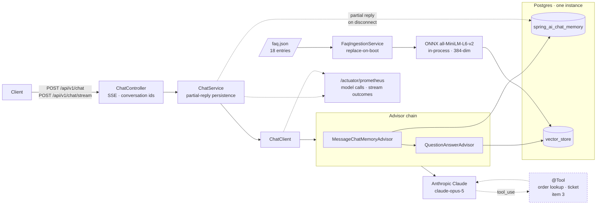
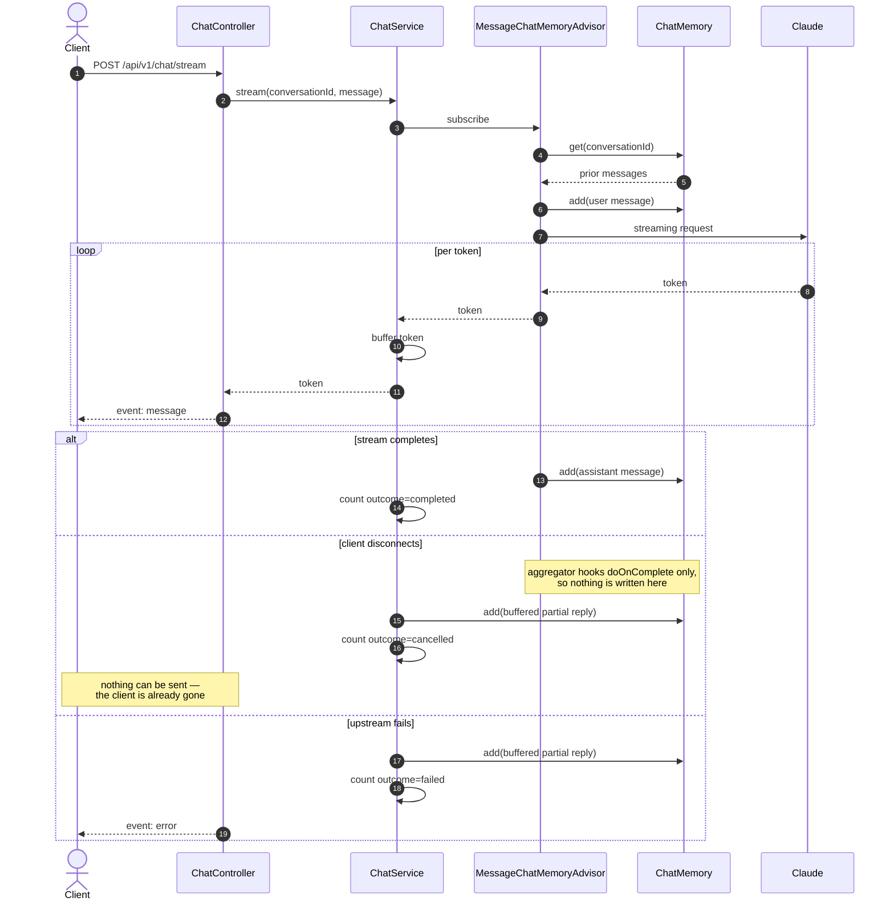

# AI Customer Service System — Java / Spring AI

[](https://github.com/lai3d/ai-customer-service-java/actions/workflows/ci.yml)
[](https://openjdk.org/projects/jdk/21/)
[](https://spring.io/projects/spring-boot)
[](LICENSE)

The Java implementation of an AI customer service backend, built on **Spring Boot 3.5**,
**Spring AI 1.1**, and **Anthropic Claude**, with retrieval-augmented answers over an FAQ corpus, tool calling for real
business actions, SSE streaming, and first-class observability.

This is not a notebook demo. It runs on virtual threads, persists conversation memory and vectors in
the same Postgres instance, exports Prometheus metrics for every model call, and ships with a
Dockerfile and Kubernetes manifests.

> **Status:** Phase 1, under active development. See [Roadmap](#roadmap).

---

## Architecture



Dashed components are Phase 1 items not yet built.

### A streaming turn

The interesting part is what happens when a client disconnects mid-answer. Spring AI writes
the user message to memory up front but writes the assistant message from an aggregator that
only hooks `doOnComplete` — so an interrupted stream would leave an orphaned user message
behind, and the next turn would send two consecutive user messages to the model.



**Why these pieces:**

| Decision | Reason |
| --- | --- |
| Virtual threads, no WebFlux | LLM calls are I/O-bound and long-lived. Loom gives the concurrency without forcing a reactive programming model on the whole codebase. `Flux` appears only as an SSE controller return type. |
| Advisor chain, never hand-built prompts | Memory and retrieval are cross-cutting concerns. Composing them as advisors keeps them testable and independently switchable. |
| pgvector in the business database | One database to run, back up, and reason about. Transactional consistency between a ticket and the conversation that created it comes for free. |
| Local ONNX embeddings | Anthropic offers no embedding API. An in-process ONNX model (`all-MiniLM-L6-v2`, 384-dim) means the RAG path needs no second vendor, no second API key, and costs nothing per query. |
| Micrometer on every model call | Token spend and latency are the two numbers that decide whether an LLM feature survives contact with production. |

---

## Tech Stack

| Layer | Choice |
| --- | --- |
| Runtime | JDK 21, virtual threads (`spring.threads.virtual.enabled=true`) |
| Framework | Spring Boot 3.5.16, Spring MVC |
| AI | Spring AI 1.1.8 — `ChatClient` + advisor chain |
| Chat model | Anthropic Claude (`claude-opus-5` by default) |
| Embeddings | Spring AI Transformers (ONNX, in-process) |
| Vector store | pgvector |
| Memory | Spring AI JDBC chat memory repository |
| Observability | Spring Boot Actuator + Micrometer → Prometheus |
| Build | Maven (wrapper included) |
| Tests | JUnit 5 + Testcontainers |

Spring AI 2.0 exists but targets Spring Boot 4.x. This project stays on the
Spring Boot 3.5 / Spring AI 1.1 line, which is the combination Spring AI 1.1.8 is built and tested
against.

---

## Quick Start

**Prerequisites:** JDK 21, Docker. Maven is not required — use the bundled wrapper.

```bash
# 1. Configure credentials
cp .env.example .env
$EDITOR .env          # set ANTHROPIC_API_KEY

# 2. Start Postgres (with the pgvector extension)
docker compose up -d

# 3. Run
set -a && source .env && set +a
./mvnw spring-boot:run
```

Verify:

```bash
curl -s localhost:8080/actuator/health | jq
curl -s localhost:8080/actuator/prometheus | grep -E '^gen_ai|^spring_ai'
```

Run the tests (Testcontainers starts its own Postgres; no `docker compose` needed):

```bash
./mvnw verify
```

---

## API

Both endpoints take the same body. Omit `conversationId` to start a new conversation; the
assigned id comes back in the `X-Conversation-Id` header of every response.

```bash
# Blocking: one JSON response
curl -sS localhost:8080/api/v1/chat \
  -H 'Content-Type: application/json' \
  -d '{"message": "Where is my order?"}' | jq

# Streaming: server-sent events
curl -N localhost:8080/api/v1/chat/stream \
  -H 'Content-Type: application/json' \
  -d '{"conversationId": "abc-123", "message": "And the second one?"}'
```

The stream emits two event types. Tokens arrive as `event: message`; a failure after the
response has been committed arrives as a terminal `event: error`, so a client never has to
guess whether an apology came from the model or from the transport.

```
event:message
data:Your order

event:message
data: shipped on Monday.
```

| Failure | Response |
| --- | --- |
| Blank or oversized message | `400` before any model call |
| Rate limited or provider overloaded | `503` with a `ProblemDetail` body — retry is worthwhile |
| Bad credentials, rejected request | `502` with a `ProblemDetail` body — retry is not |
| Failure after streaming began | `200`, terminated by an `error` event |

---

## Retrieval

The FAQ corpus lives in [`src/main/resources/faq/faq.json`](src/main/resources/faq/faq.json) —
18 entries across returns, shipping, payment, account, and support. **It is sample data.**
Replace it with your own before this answers anything real.

Ingestion runs at startup and *replaces* what it wrote last time rather than appending.
Appending on every boot would duplicate the corpus, and duplicates do not merely waste space:
they crowd out distinct passages in the top-k window, so the model sees one answer four times
instead of four different ones. Re-embedding everything on each start is affordable only
because the corpus is small and the embedding model is in-process — 18 documents in under
300 ms. A larger corpus would want per-document change detection instead.

No text splitter sits in the pipeline, deliberately. Splitters cut long prose into retrievable
pieces; an FAQ entry is already the unit a customer's question should match, and splitting one
would separate a question from its answer. A corpus of long-form policy documents would need
one.

### The similarity threshold is measured, not guessed

Below `app.rag.similarity-threshold` a passage is dropped rather than handed to the model as
fact. The value comes from running paraphrased questions — never the corpus wording — against
the real embedding model:

| Query | Top hit | Score |
| --- | --- | --- |
| "I want to send something back, is it too late after three weeks?" | `returns-window` | 0.56 |
| "how much do I pay for delivery" | `shipping-cost` | 0.63 |
| "my card was rejected at checkout" | `payment-declined` | 0.61 |
| "when can I talk to a real person" | `support-hours` | **0.34** |
| "what is the capital of France" | *(unrelated)* | 0.11 |

Correct matches span 0.34 to 0.63; unrelated questions peak at 0.11; near misses sit around
0.27 to 0.29. `0.3` clears the near misses while keeping the weakest true match. A plausible-
looking `0.4` would silently stop answering "when can I talk to a real person".

The threshold is a property of *this corpus and this embedding model*, not a universal
constant — `FaqRetrievalIntegrationTest` re-measures it on every build, against real pgvector
and the real ONNX model, so a regression surfaces as a red build rather than as vaguer answers
in production.

### Language

`all-MiniLM-L6-v2` is English-trained. Retrieval over a Chinese or multilingual corpus will be
noticeably worse. Switching to a multilingual model (`bge-m3` via Ollama, for instance) is a
configuration change plus a `dimensions` update and a rebuilt index — the retrieval code itself
does not change.

---

## Roadmap

Phase 1 is built one item at a time, each landing as a reviewable change.

- [x] **0 · Foundation** — project skeleton, Postgres + pgvector via Compose, actuator/Prometheus, CI
- [x] **1 · Conversational core** — single- and multi-turn chat over SSE, conversation memory
- [x] **2 · RAG** — FAQ ingestion pipeline and grounded answers, with retrieval quality under test
- [ ] **3 · Tool calling** — order status lookup and support ticket creation
- [ ] **4 · Deployment** — Dockerfile, one-command Docker Compose stack, Kubernetes Deployment / Service / ConfigMap

Deliberately out of scope for Phase 1: authentication, multi-tenancy, and MCP.

---

## Project Layout

```
├── docker/postgres/init/    # extensions created before the app connects
├── k8s/                     # Kubernetes manifests (phase 1, item 4)
├── src/main/java/dev/merlionos/customerservice/
│   ├── CustomerServiceApplication.java
│   └── config/              # explicit overrides of Spring AI defaults
├── src/main/resources/
└── src/test/java/           # Testcontainers-backed integration tests
```

This repository is one of a planned pair — a Go implementation of the same system lives in
a separate repository. Nothing is shared between them by design; each is idiomatic for its
own ecosystem.

---

## License

[Apache License 2.0](LICENSE)
