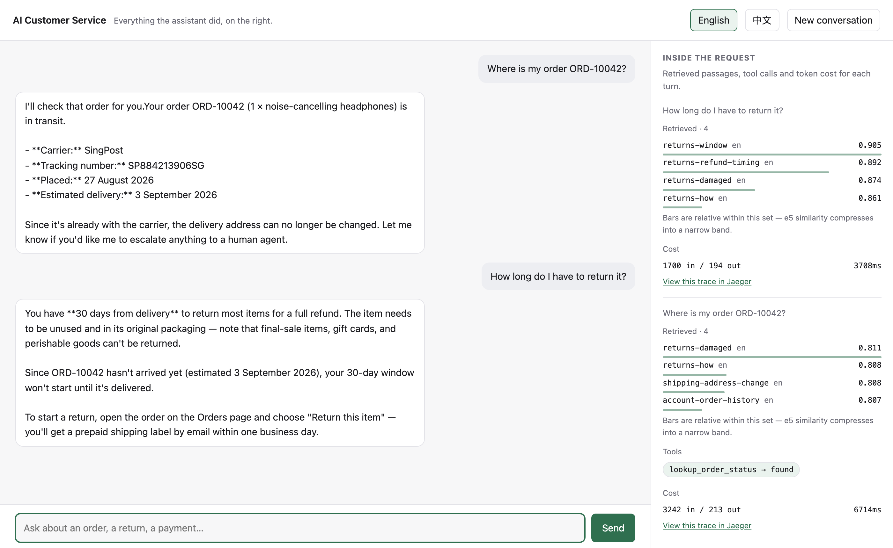
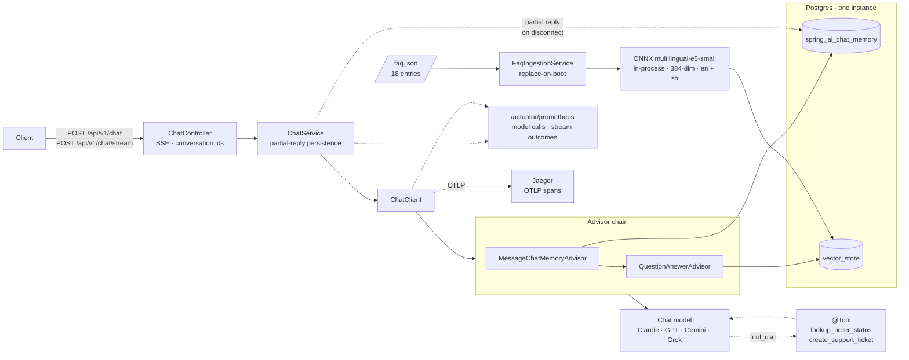
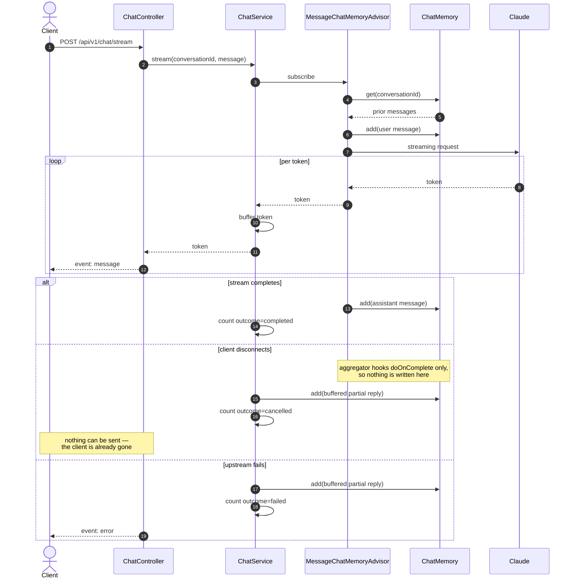
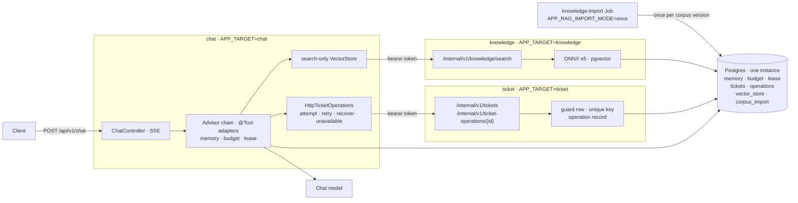

# AI Customer Service System — Java / Spring AI

**English** · [简体中文](README.zh.md)

[](https://github.com/lai3d/ai-customer-service-java/actions/workflows/ci.yml)
[](https://openjdk.org/projects/jdk/21/)
[](https://spring.io/projects/spring-boot)
[](LICENSE)

The Java implementation of an AI customer service backend, built on **Spring Boot 3.5** and
**Spring AI 1.1**, with retrieval-augmented answers over an FAQ corpus, tool calling for real
business actions, SSE streaming, and first-class observability. The chat model is a
configuration choice — **Claude, GPT, Gemini or Grok** — with Claude as the default.

This is not a notebook demo. It runs on virtual threads, persists conversation memory and vectors in
the same Postgres instance, exports Prometheus metrics for every model call, and ships with a
Dockerfile and Kubernetes manifests.

> **Status:** complete, and verified live against Anthropic, OpenAI, Gemini and Grok. The whole
> suite runs without an API key. One limit is known and written down rather than
> smoothed over: a multi-intent question can still miss the passage that answers it.
> See [Roadmap](#roadmap).

---



*A real exchange, not a mock-up. The second answer combines three things: the delivery date the
`lookup_order_status` tool returned in the previous turn, the returns policy retrieved for this
one, and the conversation memory joining them — "your 30-day window won't start until it's
delivered". The right-hand panel is what a chat widget hides.*

## What this project found


Most of what is worth reading here is a measurement or a mistake, not a feature list.

| | |
| --- | --- |
| A test asserted the similarity threshold worked, and passed — on four hand-picked samples | [Retrieval](docs/retrieval.md#the-threshold-does-not-work-and-the-first-measurement-of-that-was-too-kind) |
| The obvious multilingual model was the wrong *class* of model, and the data said so | [Retrieval](docs/retrieval.md#choosing-an-embedding-model-by-measurement) |
| Spring AI's retry defaults let a customer wait nineteen minutes | [Cost and failure](docs/reliability.md#retry-gave-up-after-nineteen-minutes) |
| A missing API key started cleanly, passed both probes, and 401'd every request | [Quick start](#quick-start) |
| The customer's question was leaving the process on every trace, with no property to stop it | [Observability](docs/observability.md#customer-messages-are-kept-out-of-traces) |
| The blocking endpoint spent money that no meter ever saw | [Cost and failure](docs/reliability.md#two-bugs-the-tests-found-not-the-code-review) |
| Virtual threads held 1000 in-flight requests on 2 platform threads instead of 202 | [Benchmark](docs/benchmark.md) |
| Two benchmark measurements gave confident wrong answers before they gave right ones | [Benchmark](docs/benchmark.md#two-measurement-mistakes-both-worth-knowing-about) |
| Spring AI's query expander silently returns the original query, on 10 of 10 attempts | [Retrieval](docs/retrieval.md#multi-intent-questions-and-what-fixed-them) |
| Every provider's seeded `temperature` is rejected by its own current model | [Chat providers](docs/providers.md#what-only-a-live-call-found) |
| Token accounting: every simple rule for it is wrong, and each was wrong differently | [Cost and failure](docs/reliability.md#a-turn-is-not-a-model-call) |
| Two independent designs for the split crossed over: each adopted the other's original boundary | [ADR 001](docs/adr/001-deployment-targets.md#addendum-2026-09-05-codexs-revised-position-and-the-owners-rulings) |
| The ticket cap was per replica; two replicas meant six tickets. Fixed by a guard row, raced from two instances | [Cost and failure](docs/reliability.md#a-prompt-is-a-request-not-a-control) |
| A phased bean condition silently admitted every controller into every process | [ADR 001](docs/adr/001-deployment-targets.md#plan) |
| The knowledge role's 2.8 GiB peak is the single-process pod's: the ONNX session was the whole footprint | [Kubernetes](k8s/README.md#what-running-the-split-found) |

---

## Architecture





### A streaming turn

The interesting part is what happens when a client disconnects mid-answer. Spring AI writes
the user message to memory up front but writes the assistant message from an aggregator that
only hooks `doOnComplete` — so an interrupted stream would leave an orphaned user message
behind, and the next turn would send two consecutive user messages to the model.



### One process, or three

Everything above is one process, and that is still the default: `docker compose up` and
`k8s/base` run it, and it is what the benchmark measures. The same jar also runs as three
roles, selected by `APP_TARGET`, with the seams in the diagram becoming HTTP:



What made the split cheap is what stayed home: the `@Tool` classes, the advisor chain and
the per-turn event bus never left the chat role, so the three constraints this codebase
defends with tests are the same in both topologies. What the split forced was moving every
piece of per-process state into Postgres, which the two-replica manifest had needed all
along: the ticket cap is a guard row locked in the creating transaction, the token budget is a
row, one turn per conversation is a lease with an expiry, and which corpus versions are
imported is a table that readiness reads. The decision record, with the two independently
written proposals it reconciles, is [ADR 001](docs/adr/001-deployment-targets.md);
[Deployment](docs/deployment.md#running-the-roles-separately) has the Compose file, the
Kubernetes manifests, the switching procedure and what running the split found.

**Why these pieces:**

| Decision | Reason |
| --- | --- |
| Virtual threads, no WebFlux | LLM calls are I/O-bound and long-lived. Loom gives the concurrency without forcing a reactive programming model on the whole codebase — [measured](docs/benchmark.md) at 3x the throughput of platform threads, holding 1000 in-flight requests on 2 platform threads instead of 202. `Flux` appears only as an SSE controller return type. |
| Advisor chain, never hand-built prompts | Memory and retrieval are cross-cutting concerns. Composing them as advisors keeps them testable and independently switchable. |
| pgvector in the business database | One database to run, back up, and reason about. Transactional consistency between a ticket and the conversation that created it comes for free. |
| Local ONNX embeddings | Anthropic offers no embedding API. An in-process ONNX model (`multilingual-e5-small`, 384-dim) means the RAG path needs no second vendor, no second API key, and costs nothing per query — and it handles English and Chinese. |
| Micrometer on every model call | Token spend and latency are the two numbers that decide whether an LLM feature survives contact with production. |

---

## Tech Stack


| Layer | Choice |
| --- | --- |
| Runtime | JDK 21, virtual threads (`spring.threads.virtual.enabled=true`) |
| Framework | Spring Boot 3.5.16, Spring MVC |
| AI | Spring AI 1.1.8 — `ChatClient` + advisor chain |
| Chat model | Anthropic Claude (`claude-opus-5`) by default; OpenAI, Google Gemini or xAI Grok by configuration |
| Embeddings | Spring AI Transformers — `multilingual-e5-small` ONNX, in-process |
| Vector store | pgvector |
| Memory | Spring AI JDBC chat memory repository |
| Observability | Actuator + Micrometer → Prometheus; Micrometer Tracing → OTLP → Jaeger |
| Build | Maven (wrapper included) |
| Tests | JUnit 5 + Testcontainers |

Spring AI 2.0 exists but targets Spring Boot 4.x. This project stays on the
Spring Boot 3.5 / Spring AI 1.1 line, which is the combination Spring AI 1.1.8 is built and tested
against.

---

## Quick Start


### Everything in containers

**Prerequisites:** Docker. Nothing else — no JDK, no Maven.

```bash
cp .env.example .env
$EDITOR .env               # set ANTHROPIC_API_KEY

docker compose up -d       # Postgres, then the app once Postgres is healthy
curl -s localhost:8080/actuator/health | jq
open http://localhost:8080         # the demo UI
open http://localhost:16686        # Jaeger: traces for every chat turn
```

The image bakes in the embedding model, so a cold start downloads nothing at runtime and
reaches ready in a few seconds. See [`docs/deployment.md`](docs/deployment.md) for the image
layout, the Kubernetes manifests in [`k8s/`](k8s/README.md), and why the model is baked in
rather than mounted.

### Running the app from your IDE

**Prerequisites:** JDK 21, Docker. Maven is not required — use the bundled wrapper.

```bash
docker compose up -d postgres      # just the database
set -a && source .env && set +a
./mvnw spring-boot:run
```

Verify:

```bash
curl -s localhost:8080/actuator/health | jq
curl -s localhost:8080/actuator/prometheus | grep -E '^gen_ai|^chat_'
```

Run the tests — Testcontainers starts its own Postgres, and nothing reaches the Anthropic API,
so no key is needed:

```bash
./mvnw verify
```

Starting without `ANTHROPIC_API_KEY` fails immediately and says so. That is deliberate: Spring's
binder ignores an unresolvable placeholder, so without an explicit check the application would
start, report itself healthy, be marked ready by Kubernetes, and then fail every customer
request with a 401.

---

## API


Both endpoints take the same body. Omit `conversationId` to start a new conversation; the
assigned id comes back in the `X-Conversation-Id` header of every response.

```bash
# Blocking: one JSON response
curl -sS localhost:8080/api/v1/chat \
  -H 'Content-Type: application/json' \
  -d '{"message": "Where is my order?"}' | jq

# Streaming: server-sent events
curl -N localhost:8080/api/v1/chat/stream \
  -H 'Content-Type: application/json' \
  -d '{"conversationId": "abc-123", "message": "And the second one?"}'
```

The stream emits two event types. Tokens arrive as `event: message`; a failure after the
response has been committed arrives as a terminal `event: error`, so a client never has to
guess whether an apology came from the model or from the transport.

```
event:message
data:Your order

event:message
data: shipped on Monday.
```

| Failure | Response |
| --- | --- |
| Blank or oversized message | `400` before any model call |
| A turn already in flight on this conversation | `409` with a `ProblemDetail` body — retry once it has finished |
| Rate limited or provider overloaded | `503` with a `ProblemDetail` body — retry is worthwhile |
| Bad credentials, rejected request | `502` with a `ProblemDetail` body — retry is not |
| Failure after streaming began | `200`, terminated by an `error` event |

---

## Deeper reading

The README is the tour. Each of these is the part of the system where a decision was made
against evidence, and says what the evidence was.

| | |
| --- | --- |
| [Retrieval](docs/retrieval.md) | The bilingual FAQ corpus, choosing an embedding model by measurement, and why the similarity threshold stopped meaning anything |
| [Tool calling](docs/tools.md) | Why a missing order is a value rather than an exception, why ticket creation is idempotent, and how a tool learns which conversation it is serving |
| [Observability](docs/observability.md) | OpenTelemetry traces over OTLP, and keeping the customer's own words out of them |
| [Cost and failure](docs/reliability.md) | Token budgets, HTTP timeouts, bounded retry, bounded tool side effects, graceful shutdown |
| [Virtual threads, measured](docs/benchmark.md) | 3x the throughput and 202 platform threads down to 2 — plus two measurements that were confidently wrong first |
| [Chat providers](docs/providers.md) | Anthropic, OpenAI, Gemini and xAI by configuration — and why xAI is a provider rather than a base-URL trick |
| [The demo UI](docs/demo-ui.md) | A glass box rather than a chat widget, and the two backend problems it forced into the open |
| [Deployment](docs/deployment.md) | The container image, the Compose stack, and the Kubernetes manifests |
| [Deployment targets](docs/adr/001-deployment-targets.md) | Built: one artifact run as one process or as three roles. Reconciles two independent proposals, [Claude](docs/dual-target.md) and [Codex](docs/CODEX_DUAL_DEPLOYMENT_DESIGN.md), and records what was kept from each |
| [Codex deployment decision](docs/CODEX_DUAL_DEPLOYMENT_DECISION.md) | Codex's revised recommendation after comparing both deployment proposals; implementation gates and remaining decisions |

---

## Roadmap


Phase 1 is built one item at a time, each landing as a reviewable change.

- [x] **0 · Foundation** — project skeleton, Postgres + pgvector via Compose, actuator/Prometheus, CI
- [x] **1 · Conversational core** — single- and multi-turn chat over SSE, conversation memory
- [x] **2 · RAG** — FAQ ingestion pipeline and grounded answers, with retrieval quality under test
- [x] **3 · Tool calling** — order status lookup and support ticket creation
- [x] **4 · Deployment** — Dockerfile, one-command Docker Compose stack, Kubernetes manifests verified on kind
- [x] **5 · Bilingual retrieval** — Chinese corpus, multilingual embeddings, cross-lingual tests
- [x] **6 · Tracing** — OpenTelemetry spans over OTLP to Jaeger, with customer messages excluded
- [x] **7 · Multi-provider** — Anthropic, OpenAI, Gemini and xAI, all four verified live
- [x] **8 · Demo UI** — a glass-box page showing retrieval, tool calls and token cost per turn
- [x] **9 · Cost and failure** — per-conversation token budget, HTTP timeouts, bounded retry, cost metrics
- [x] **10 · Benchmark** — evidence for the virtual-thread decision: 3x throughput, 202 threads down to 2
- [x] **11 · Hardening** — bounded tool side effects, graceful shutdown, SSE keep-alive
- [x] **12 · Deployment targets** — the same artifact as one process or as three roles, decided by two independent designs reconciled in [ADR 001](docs/adr/001-deployment-targets.md); shared state moved to Postgres under Flyway; both topologies verified in Compose, on kind and in CI

Every item is done, and the system has been run end to end against the live API: a Chinese
question retrieves Chinese passages and is answered in Chinese, both tools round-trip, real token
usage reaches the budget and the spans, and asked something the corpus does not cover the
assistant says so rather than inventing an answer.

**What is not done, stated rather than implied:**

- One of fourteen multi-intent questions still misses the passage that answers it. Fixing it
  would mean putting a third of the corpus into every prompt; the measurement behind that
  decision is in [Retrieval](docs/retrieval.md#multi-intent-questions-and-what-fixed-them).
- There is no evaluation harness scoring answer quality against a golden set — the retrieval
  measurements say which passage was found, not whether the answer was good.

Deliberately out of scope: authentication, multi-tenancy, and MCP.

## The same system in Go

[**lai3d/ai-customer-service-go**](https://github.com/lai3d/ai-customer-service-go) is the same
system built as a comparison rather than a port — same corpus, same benchmark parameters, same
providers, nothing shared between the repositories by design.

The benchmark is the same 1000 concurrent requests against a 1000 ms stubbed model, on the full
production path. Go's rows were measured there; the Java rows are [this repository's](docs/benchmark.md):

| | duration | throughput | p50 | OS threads |
|---|---|---|---|---|
| Java, platform threads | 6254 ms | 160 req/s | 4037 ms | 246 |
| Java, virtual threads | 2220 ms | 450 req/s | 1767 ms | 53 |
| Go, goroutines | 1667 ms | 600 req/s | 1648 ms | 135 |

The Java rows are the current code: about 10% slower on the virtual run than
[first measured](docs/benchmark.md), since every request now takes a conversation lease and
records its spend in Postgres rather than in a map. Both sets of numbers are kept there, next
to the same load run against the [split topology](docs/benchmark.md#the-same-load-with-the-roles-in-separate-processes):
448 req/s and 1819 ms p50 with retrieval crossing a socket, on the same two platform threads.

Go is about 25% faster with a much flatter tail — p50 to p99 inside 17 ms, against 430 ms here —
and spends several times the OS threads to get it, because a goroutine inside a cgo call blocks
its thread and the scheduler responds by making another. The JVM avoids that with the same ONNX
model by bounding the carrier pool at the core count: it wins that one by being **less** clever,
not more.

**The cross-review found ten defects between the two repositories, and neither test suite was
failing on any of them.** Four of those were here. The Go implementation measured the raw wire
and showed that [the usage-grouping rule](docs/reliability.md#a-turn-is-not-a-model-call) is a
property of Spring AI's abstraction rather than of the protocols; it flagged that
[the retrieval threshold](docs/retrieval.md) was under-sampled, which it was, worse than the
first measurement admitted; and driving its demo page in a browser exposed that neither page
rendered the Markdown the model writes, nor broke the seam between a tool-calling turn's two
model calls — [visible in this README's own screenshot](docs/images/demo.png) for weeks, and
in a database row for as long.

Three of those defects had the same shape, and it is the finding worth keeping: **a green test
asserting against a fixture that was built to satisfy the claim.** A threshold test comparing
four hand-picked questions, a usage contract satisfied only by a stub, a persistence claim
resting on a mocked model. A test written from the same understanding as the code confirms the
understanding, not the code — and none of the three was caught from the inside. That is the
argument for the exercise, more than any latency number: two implementations mean two readers
who share the context to know where to look and none of the assumptions about what is settled.

The runtime comparison's most useful result is the same kind of thing, and it runs both ways.
Three constraints this codebase defends with tests — advisor ordering, a tool's context being
non-empty, which embedding overload applies the `query:` marker — are structural in Go, so those
bugs cannot be written there. Three move the other way: Go's scheduler answers a blocked cgo
call by making another OS thread, so the same ONNX model that costs this service 52 platform
threads costs it 135–276 until concurrency is bounded deliberately; `http.Client{}` has no
default timeout at all, where Spring at least ships a bad one loudly enough to be overridden;
and a nil map, an unchecked error and a data race all remain available there, two of which this
compiler refuses.

So the pair does not rank the runtimes. It shows the same class of problem moving between the
compiler, the test suite and the author's discipline depending on which one you pick — and the
migrations are the part worth reading, in both directions.

---

## Project Layout


```
├── Dockerfile               # 3 stages; embedding model baked in, no runtime downloads
├── docker-compose.yml       # full stack, or `up -d postgres` for IDE development
├── docker/postgres/init/    # extensions created before the app connects
├── docs/                    # the deeper reading linked above
├── k8s/                     # base/ for one process, roles/ for three plus an import Job, kind/ harness
├── docker-compose.services.yml   # the split as containers; scripts/verify-services.sh asserts it
├── src/main/java/dev/merlionos/customerservice/
│   ├── CustomerServiceApplication.java   # imports one gated configuration per role
│   ├── target/              # app.target: all (default) or one role
│   ├── chat/ clients/ config/ cost/ orders/ provider/ tools/   # the chat role
│   ├── rag/                 # the knowledge role; rag/api/ is its contract
│   ├── ticket/              # the ticket role; ticket/api/ is its contract
│   └── internal/            # the token filter on /internal/** when the roles are split
├── src/main/resources/
└── src/test/java/           # Testcontainers-backed integration tests
```

This repository is one of a pair. The Go implementation is at
[lai3d/ai-customer-service-go](https://github.com/lai3d/ai-customer-service-go); nothing is
shared between them by design, and each is idiomatic for its own ecosystem.

---

## License


[Apache License 2.0](LICENSE)
