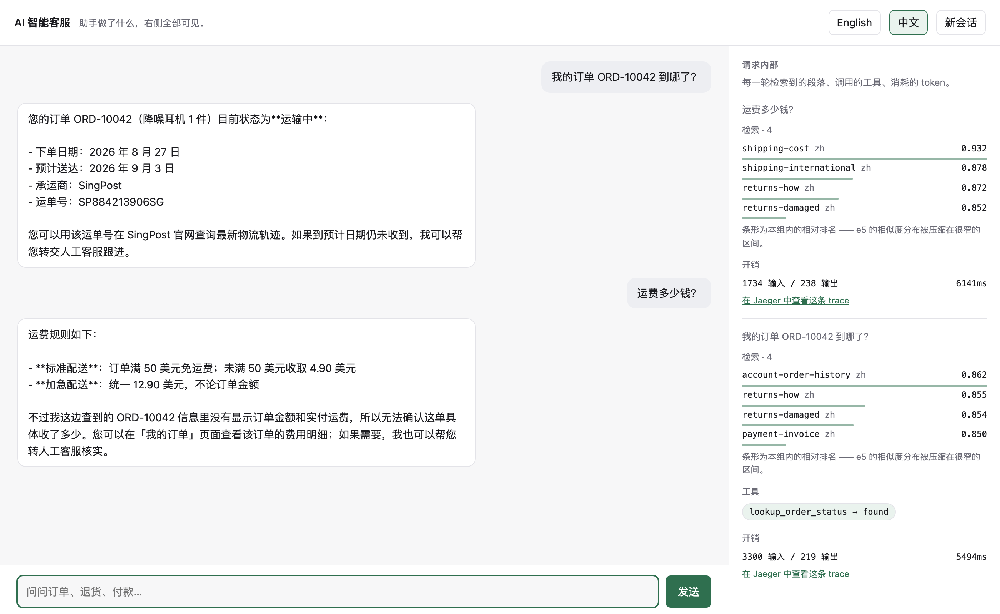
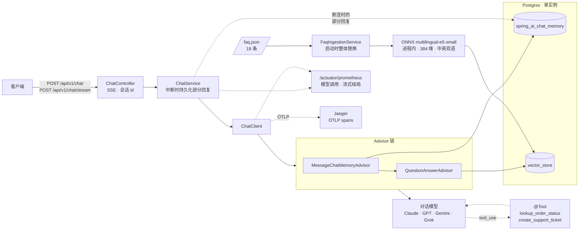
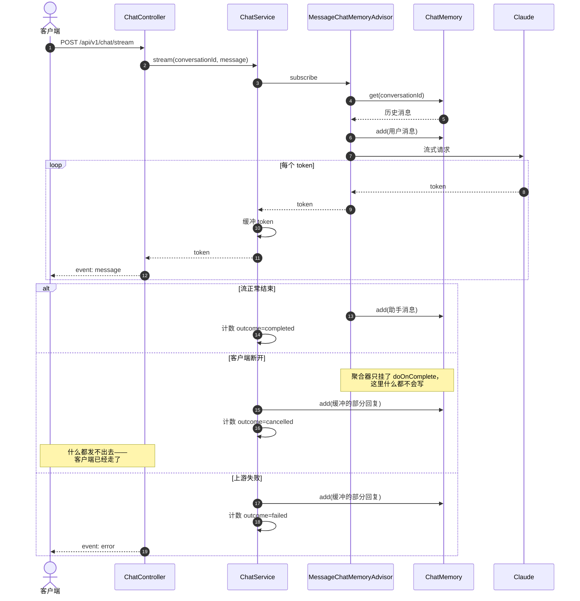

# AI 智能客服系统 — Java / Spring AI

[English](README.md) · **简体中文**

[](https://github.com/lai3d/ai-customer-service-java/actions/workflows/ci.yml)
[](https://openjdk.org/projects/jdk/21/)
[](https://spring.io/projects/spring-boot)
[](LICENSE)

一个 AI 智能客服后端的 Java 实现，基于 **Spring Boot 3.5** 和 **Spring AI 1.1**：
基于 FAQ 语料的检索增强回答、面向真实业务动作的工具调用、SSE 流式输出，以及一等公民级别的可观测性。
对话模型是一个配置项——**Claude、GPT、Gemini 或 Grok**——默认是 Claude。

这不是一个 notebook demo。它跑在虚拟线程上，会话记忆和向量存在同一个 Postgres 实例里，
每一次模型调用都导出 Prometheus 指标，并附带 Dockerfile 和 Kubernetes 清单。

> **状态：** 已完成，并对 Anthropic、OpenAI、Gemini 和 Grok 四家做过真实调用验证。
> 整套测试不需要 API key 就能跑。有一个已知限制，写下来而不是抹平：
> 多意图问题仍可能漏掉能回答它的那个段落。见 [路线图](#路线图)。

---



*真实对话，不是效果图。第二个回答把三样东西合在了一起：上一轮 `lookup_order_status`
工具返回的预计送达日期、本轮检索到的退货政策，以及把两者连起来的会话记忆——
"由于订单尚未送达，30 天窗口要等签收后才开始"。右侧那一栏，正是聊天挂件会藏起来的部分。*

## 这个项目发现了什么

这里值得读的绝大部分内容，是一次测量或一个错误，而不是功能清单。

| | |
| --- | --- |
| 一条断言"相似度阈值有效"的测试通过了——因为它只比了四个手挑样本 | [检索](docs/retrieval.md#the-threshold-does-not-work-and-the-first-measurement-of-that-was-too-kind) |
| 那个"显然该选"的多语言模型选错了*类别*，而数据早就这么说了 | [检索](docs/retrieval.md#choosing-an-embedding-model-by-measurement) |
| Spring AI 的重试默认值能让一个客户等十九分钟 | [成本与失败](docs/reliability.md#retry-gave-up-after-nineteen-minutes) |
| 缺失的 API key：启动干净、两个探针都过、然后每个请求 401 | [快速开始](#快速开始) |
| 客户的问题正随着每一条 trace 离开进程，而且没有开关可以关掉 | [可观测性](docs/observability.md#customer-messages-are-kept-out-of-traces) |
| 阻塞式端点花掉的钱，没有任何一个仪表看见 | [成本与失败](docs/reliability.md#two-bugs-the-tests-found-not-the-code-review) |
| 虚拟线程用 2 个平台线程扛住 1000 个在途请求，而不是 202 个 | [基准测试](docs/benchmark.md) |
| 两次基准测量在给出正确答案之前，先自信地给出了错误答案 | [基准测试](docs/benchmark.md#two-measurement-mistakes-both-worth-knowing-about) |
| Spring AI 的查询扩展器静默返回原查询，10 次里 10 次 | [检索](docs/retrieval.md#multi-intent-questions-and-what-fixed-them) |
| 每一家 provider 预置的 `temperature`，都被它自己的当前模型拒绝 | [模型提供方](docs/providers.md#what-only-a-live-call-found) |
| Token 计账：每一条"显然对"的规则都是错的，而且错法各不相同 | [成本与失败](docs/reliability.md#a-turn-is-not-a-model-call) |

---

## 架构



### 一次流式对话

有意思的部分是客户端在回答中途断开时会发生什么。Spring AI 会在开头把用户消息写进记忆，
但助手消息是由一个只挂了 `doOnComplete` 的聚合器写的——所以一个被中断的流会留下一条孤儿用户消息，
下一轮就会把两条连续的用户消息发给模型。



### 一个进程，或者三个

上面的一切默认仍是一个进程，`docker compose up` 和 `k8s/base` 跑的就是它，benchmark 量的也是它。同一个 jar 也能按 `APP_TARGET` 拆成 chat、knowledge、ticket 三个角色跑，图中的接缝变成带 bearer token 的内部 HTTP 接口，语料由一次性的 Job 导入，每个进程的状态都在 Postgres 里。拆分之所以便宜，是因为 `@Tool` 类、advisor 链和按 turn 的事件总线都留在 chat 角色里，本仓库用测试守住的三条约束在两种拓扑下完全一样。决策记录见 [ADR 001](docs/adr/001-deployment-targets.md)，Compose 文件、Kubernetes 清单、切换流程和运行拆分时的发现见 [部署文档](docs/deployment.md#running-the-roles-separately)（英文）。

**为什么是这些选择：**

| 决策 | 理由 |
| --- | --- |
| 虚拟线程，不用 WebFlux | LLM 调用是 I/O 密集且长时间的。Loom 给了并发能力，又不必让整个代码库变成响应式编程模型——[实测](docs/benchmark.md)吞吐是平台线程的 3 倍，用 2 个平台线程而非 202 个扛住 1000 个在途请求。`Flux` 只出现在 SSE 控制器的返回类型上。 |
| Advisor 链，绝不手工拼提示词 | 记忆和检索是横切关注点。用 advisor 组合它们，可测试、可独立替换。 |
| pgvector 放在业务库里 | 只需要运维、备份、推理一个数据库。工单和创建它的那段会话之间的事务一致性是白送的。 |
| 本地 ONNX 嵌入 | Anthropic 没有 embedding API。进程内 ONNX 模型（`multilingual-e5-small`，384 维）让 RAG 路径不需要第二个厂商、第二个 key，每次查询零成本——而且中英文都能处理。 |
| 每次模型调用都上 Micrometer | Token 花费和延迟，是决定一个 LLM 功能能否在生产环境活下来的两个数字。 |

---

## 技术栈

| 层 | 选型 |
| --- | --- |
| 运行时 | JDK 21，虚拟线程（`spring.threads.virtual.enabled=true`） |
| 框架 | Spring Boot 3.5.16，Spring MVC |
| AI | Spring AI 1.1.8 — `ChatClient` + advisor 链 |
| 对话模型 | 默认 Anthropic Claude（`claude-opus-5`）；可配置切换到 OpenAI、Google Gemini 或 xAI Grok |
| 嵌入 | Spring AI Transformers — `multilingual-e5-small` ONNX，进程内 |
| 向量库 | pgvector |
| 记忆 | Spring AI JDBC chat memory repository |
| 可观测性 | Actuator + Micrometer → Prometheus；Micrometer Tracing → OTLP → Jaeger |
| 构建 | Maven（含 wrapper） |
| 测试 | JUnit 5 + Testcontainers |

Spring AI 2.0 已经存在，但它面向 Spring Boot 4.x。本项目留在
Spring Boot 3.5 / Spring AI 1.1 这条线上，因为这正是 Spring AI 1.1.8 构建和测试所针对的组合。

---

## 快速开始

### 全部跑在容器里

**前置条件：** Docker。其他什么都不需要——不用 JDK，不用 Maven。

```bash
cp .env.example .env
$EDITOR .env               # 设置 ANTHROPIC_API_KEY

docker compose up -d       # 先 Postgres，等它健康后再起应用
curl -s localhost:8080/actuator/health | jq
open http://localhost:8080         # 演示界面
open http://localhost:16686        # Jaeger：每一轮对话的 trace
```

镜像里烤进了嵌入模型，所以冷启动不会在运行时下载任何东西，几秒钟就 ready。
镜像分层、[`k8s/`](k8s/README.md) 里的 Kubernetes 清单，以及为什么模型是烤进去而不是挂载进去，
见 [`docs/deployment.md`](docs/deployment.md)。

### 从 IDE 里跑应用

**前置条件：** JDK 21，Docker。不需要装 Maven——用自带的 wrapper。

```bash
docker compose up -d postgres      # 只起数据库
set -a && source .env && set +a
./mvnw spring-boot:run
```

验证：

```bash
curl -s localhost:8080/actuator/health | jq
curl -s localhost:8080/actuator/prometheus | grep -E '^gen_ai|^chat_'
```

跑测试——Testcontainers 会自己起一个 Postgres，且没有任何请求会打到 Anthropic API，
所以不需要 key：

```bash
./mvnw verify
```

不带 `ANTHROPIC_API_KEY` 启动会立刻失败并说明原因。这是有意为之：Spring 的 binder
会忽略无法解析的占位符，所以如果不做显式检查，应用会正常启动、自报健康、被 Kubernetes 标记为
ready，然后用 401 拒掉每一个客户请求。

---

## API

两个端点接受同样的请求体。省略 `conversationId` 表示开启新会话；分配到的 id
会在每个响应的 `X-Conversation-Id` 头里返回。

```bash
# 阻塞式：一个 JSON 响应
curl -sS localhost:8080/api/v1/chat \
  -H 'Content-Type: application/json' \
  -d '{"message": "我的订单到哪了？"}' | jq

# 流式：server-sent events
curl -N localhost:8080/api/v1/chat/stream \
  -H 'Content-Type: application/json' \
  -d '{"conversationId": "abc-123", "message": "那第二个订单呢？"}'
```

流会发出两类事件。Token 以 `event: message` 到达；响应已经提交之后才发生的失败，
会作为终止性的 `event: error` 到达——这样客户端永远不必猜一句道歉是来自模型还是来自传输层。

```
event:message
data:您的订单

event:message
data:已于周一发出。
```

| 失败 | 响应 |
| --- | --- |
| 空消息或消息过长 | 在任何模型调用之前返回 `400` |
| 被限流或 provider 过载 | `503`，带 `ProblemDetail` 体——值得重试 |
| 凭证错误、请求被拒 | `502`，带 `ProblemDetail` 体——重试没用 |
| 开始流式输出之后失败 | `200`，以一个 `error` 事件收尾 |

---

## 延伸阅读

README 是一次导览。下面每一篇，都是系统中某个"依据证据做出决定"的地方，并且写明了证据是什么。
（这些文档目前是英文的。）

| | |
| --- | --- |
| [Retrieval](docs/retrieval.md) | 中英双语 FAQ 语料、用测量而非直觉选嵌入模型，以及相似度阈值为什么不再有意义 |
| [Tool calling](docs/tools.md) | 为什么"订单不存在"是一个值而不是异常、工单创建为什么幂等，以及工具如何知道自己在服务哪段会话 |
| [Observability](docs/observability.md) | 走 OTLP 的 OpenTelemetry trace，以及如何把客户原话挡在外面 |
| [Cost and failure](docs/reliability.md) | Token 预算、HTTP 超时、有界重试、有界工具副作用、优雅停机 |
| [Virtual threads, measured](docs/benchmark.md) | 3 倍吞吐、202 个平台线程降到 2 个——外加两次先自信地错了的测量 |
| [Chat providers](docs/providers.md) | 用配置切换 Anthropic、OpenAI、Gemini 和 xAI——以及 xAI 为什么是一个 provider 而不是改 base-URL 的花招 |
| [The demo UI](docs/demo-ui.md) | 一个玻璃盒子而不是聊天挂件，以及它逼出来的两个后端问题 |
| [Deployment](docs/deployment.md) | 容器镜像、Compose 栈和 Kubernetes 清单 |

---

## 路线图

第一阶段按条目逐个推进，每一条都以一次可评审的改动落地。

- [x] **0 · 地基** — 项目骨架、Compose 起 Postgres + pgvector、actuator/Prometheus、CI
- [x] **1 · 对话内核** — SSE 上的单轮与多轮对话、会话记忆
- [x] **2 · RAG** — FAQ 摄入流水线与有依据的回答，检索质量有测试覆盖
- [x] **3 · 工具调用** — 订单状态查询与工单创建
- [x] **4 · 部署** — Dockerfile、一条命令的 Docker Compose 栈、经 kind 验证过的 Kubernetes 清单
- [x] **5 · 双语检索** — 中文语料、多语言嵌入、跨语言测试
- [x] **6 · 链路追踪** — 经 OTLP 到 Jaeger 的 OpenTelemetry span，排除客户消息
- [x] **7 · 多 provider** — Anthropic、OpenAI、Gemini 和 xAI，四家全部真实调用验证
- [x] **8 · 演示界面** — 一个玻璃盒页面，逐轮展示检索、工具调用和 token 成本
- [x] **9 · 成本与失败** — 按会话的 token 预算、HTTP 超时、有界重试、成本指标
- [x] **10 · 基准测试** — 虚拟线程这个决策的证据：3 倍吞吐、202 线程降到 2
- [x] **11 · 加固** — 有界工具副作用、优雅停机、SSE keep-alive
- [x] **12 · 部署形态** — 同一个制品既能作为单进程跑，也能拆成 chat、knowledge、ticket 三个角色跑，由两份独立设计在 [ADR 001](docs/adr/001-deployment-targets.md) 中调和后决定；共享状态迁入 Postgres 并由 Flyway 管理；两种拓扑在 Compose、kind 和 CI 上都经过验证

每一条都已完成，整个系统也已对真实 API 端到端跑过：中文问题会检索到中文段落并用中文作答，
两个工具都能完整往返，真实 token 用量会进到预算和 span 里，问一个语料没覆盖的问题时，
助手会直说不知道，而不是编一个答案。

**没有做的部分，明说而不是暗示：**

- 十四个多意图问题里，仍有一个漏掉了能回答它的段落。修好它意味着把三分之一的语料塞进每个提示词；
  这个决定背后的测量在 [Retrieval](docs/retrieval.md#multi-intent-questions-and-what-fixed-them)。
- 没有对照黄金集给答案质量打分的评测框架——检索测量说的是"找到了哪个段落"，不是"答得好不好"。

有意排除在范围外的：鉴权、多租户、MCP。

## 同一个系统的 Go 实现

[**lai3d/ai-customer-service-go**](https://github.com/lai3d/ai-customer-service-go/blob/main/README.zh.md)（中文版）
是同一个系统，作为**对照**而非移植来构建——同一份语料、同一套基准参数、同样的 provider，
两个仓库之间刻意不共享任何东西。

基准测试是同样的 1000 并发请求打向一个 1000ms 的桩模型，走完整生产路径。Go 那几行在那边测得，
Java 这几行来自[本仓库](docs/benchmark.md)：

| | 耗时 | 吞吐 | p50 | OS 线程 |
|---|---|---|---|---|
| Java，平台线程 | 6254 ms | 160 req/s | 4037 ms | 246 |
| Java，虚拟线程 | 2000 ms | 500 req/s | 1616 ms | 52 |
| Go，goroutine | 1667 ms | 600 req/s | 1648 ms | 135 |

Go 快约 20%，长尾平坦得多——p50 到 p99 在 17ms 以内，而这边是 370ms——代价是几倍的 OS 线程：
goroutine 进入 cgo 调用会阻塞它所在的线程，调度器的应对方式是再造一个。JVM 用同一个 ONNX
模型不会这样，因为它把载体线程池按核数封了顶：**它赢在更笨，不是更聪明。**

**交叉评审在两个仓库之间找到了十个缺陷，而两边的测试套件都没有一条是红的。** 其中四个在这边。
Go 实现测量了原始协议，指出
[用量分组规则](docs/reliability.md#a-turn-is-not-a-model-call)是 Spring AI 抽象层的属性而非协议的属性；
它还指出[检索阈值](docs/retrieval.md)采样不足——确实如此，而且比第一次测量承认的更严重；
再有就是，在真实浏览器里驱动它的演示页面暴露出：**两边的页面都没有渲染模型写出的 Markdown，
也都没有在一轮工具调用的两次模型调用之间断开接缝**——这两个问题在
[本 README 自己的截图](docs/images/demo.png)里挂了好几周，在数据库的一行记录里也挂了同样久。

这十个里有三个是同一个形状，也是最值得留下的发现：**一条通过的测试，
断言的对象是一个为满足该主张而构造的夹具。** 一条只比了四个手挑问题的阈值测试、
一份只有 stub 才满足的用量契约、一个建立在 mock 模型上的持久化结论。
用同一份理解写出来的测试，确认的是那份理解，不是代码——而这三个没有一个是从内部发现的。
这比任何延迟数字都更能说明做这件事的意义：两个实现意味着两个读者，
他们共享足够的上下文知道该往哪儿看，却不共享"什么已经定论了"的假设。

运行时对比里最有用的结论也是同一类东西，而且是双向的。三个约束在本代码库靠测试守——
advisor 顺序、工具的 context 不能为空、哪个嵌入重载会加 `query:` 标记——在 Go 里是结构性的，
那些 bug 在那边写不出来。另外三个方向相反：Go 的调度器面对阻塞的 cgo 调用会再造一个 OS 线程，
所以同一个 ONNX 模型在这边花 52 个平台线程，在那边要花 135–276 个，除非刻意去限制并发；
`http.Client{}` **根本没有默认超时**，而 Spring 至少给了一个糟糕的默认值，糟得足够响、能被覆盖；
还有 nil map、未检查的 error 和 data race 在那边依然可写，其中两个是这边的编译器会直接拒绝的。

所以这一对不是给两个运行时排名。它展示的是**同一类问题在编译器、测试套件和作者自律之间迁移**，
取决于你选了哪一个——而这些迁移，才是双向都值得读的部分。

---

## 项目结构

```
├── Dockerfile               # 3 个阶段；嵌入模型烤进镜像，运行时零下载
├── docker-compose.yml       # 完整栈，或 `up -d postgres` 供 IDE 开发
├── docker/postgres/init/    # 应用连接前先建好扩展
├── docs/                    # 上面链接的延伸阅读
├── k8s/                     # Namespace、ConfigMap、Deployment、Service、Secret 模板
├── src/main/java/dev/merlionos/customerservice/
│   ├── CustomerServiceApplication.java
│   └── config/              # 对 Spring AI 默认值的显式覆盖
├── src/main/resources/
└── src/test/java/           # Testcontainers 支撑的集成测试
```

本仓库是一对中的一个。Go 实现在
[lai3d/ai-customer-service-go](https://github.com/lai3d/ai-customer-service-go/blob/main/README.zh.md)（中文版，[English](https://github.com/lai3d/ai-customer-service-go)）；
两者之间刻意不共享任何东西，各自遵循自己生态的惯例。

---

## 许可证

[Apache License 2.0](LICENSE)
