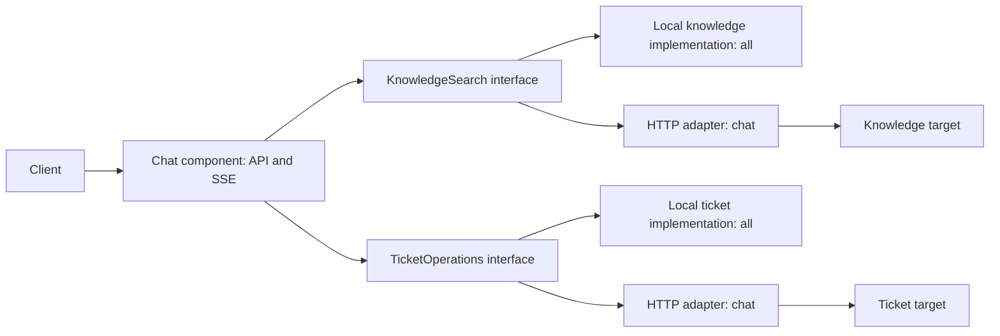

# Dual Deployment Design — Codex Proposal

- **Author:** Codex
- **Date:** 2026-09-05
- **Status:** Proposed; awaiting comparison with Claude Code's independent design.
- **Repository baseline:** `83daa3923c89ed684b3c767c69200e2463e50373`.
- **Scope:** Architecture and implementation plan. Targets, APIs, modules, and commands below are proposed, not available features.

## Recommendation

Support all-in-one and distributed deployment from one codebase, one executable JAR,
and initially one Docker image. An explicit `app.target` selects `all`, `chat`,
`knowledge`, or `ticket`. Default to `all` to preserve the existing development workflow.
Business rules and durable data formats remain identical in both modes; module calls
use either a local implementation or an HTTP adapter.

Loki provides the relevant precedent: its binary contains the components, and a target
selects which ones run. This proposal borrows that packaging and composition pattern,
not Loki's storage, replication, or service-discovery architecture.
See [Loki deployment modes](https://grafana.com/docs/loki/latest/get-started/deployment-modes/).

All-in-one means one **application** process. PostgreSQL and the selected LLM provider
remain dependencies. Distributed mode initially uses the same release across roles;
independent scaling does not imply independently versioned products.

## Current Architecture and Constraints

The repository is a single Maven application using Java 21, Spring Boot 3.5, Spring MVC,
virtual threads, and Spring AI. Preserve those choices and route model calls through
`ChatClient`.

| Current component | Implication for extraction |
| --- | --- |
| [ChatClientConfig](../src/main/java/dev/merlionos/customerservice/config/ChatClientConfig.java) | Directly wires memory, `VectorStore`, advisors, and tools; remote retrieval needs a new adapter. |
| [EmbeddingConfig](../src/main/java/dev/merlionos/customerservice/rag/EmbeddingConfig.java) and [FaqIngestionService](../src/main/java/dev/merlionos/customerservice/rag/FaqIngestionService.java) | Knowledge owns ONNX inference and ingestion, currently triggered at application startup. |
| [SupportTicketTools](../src/main/java/dev/merlionos/customerservice/tools/SupportTicketTools.java) | Mixes tool adaptation, in-memory business state, and chat event publication. Separate these responsibilities. |
| [ConversationBudget](../src/main/java/dev/merlionos/customerservice/cost/ConversationBudget.java) | Budget state is per-process; deployment flexibility requires durable shared accounting. |
| [TurnUsage](../src/main/java/dev/merlionos/customerservice/chat/TurnUsage.java) | Usage reconstruction has documented provider/call-boundary limitations; decomposition does not correct them. |
| [Application configuration](../src/main/resources/application.yml) | Chat, embedding, vector, and memory auto-configuration currently share one application context. |

Conversation memory already uses PostgreSQL. Persisting it does not itself guarantee
safe concurrent updates to the same conversation. Likewise, isolating SSE channels by
turn does not serialize memory writes. Both need explicit acceptance tests.

## Component and Deployment Boundaries

| Target | Owns | Calls | Must not initialize |
| --- | --- | --- | --- |
| `all` | All three components; public API and UI | Local Java interfaces | Remote knowledge/ticket clients |
| `chat` | API, SSE, memory, prompts, advisors, provider calls, budget, tool adapters | Knowledge and ticket HTTP APIs; existing order adapter | Local embeddings, vector store, ticket repository |
| `knowledge` | Search, embedding, corpus versions, ingestion | Its PostgreSQL storage | Chat providers, chat memory, ticket logic, public chat routes/UI |
| `ticket` | Ticket persistence, deduplication, capacity checks | Its PostgreSQL storage | Chat providers, embeddings, chat memory, public chat routes/UI |

Order lookup remains behind the existing tool adapter until there is a real order system
to integrate. Do not create a separate mock order service. Budget remains part of chat;
there is no initial gateway, billing service, registry, message broker, or service mesh.



Each interface has exactly one active adapter. HTTP controllers invoke the same business
implementations used locally. Business modules never publish `TurnEvent` or depend on
`ToolContext`; the chat adapter turns returned results into the existing SSE events.

## Build and Spring Composition

Proposed Maven modules:

```text
contracts/       # Small, versioned DTOs and component interfaces; no Spring AI types
chat/            # Chat orchestration, provider integration, local/HTTP port selection
knowledge/       # Knowledge implementation, storage, internal HTTP adapter
ticket/          # Ticket implementation, storage, internal HTTP adapter
app/             # Boot launcher and explicit role composition; executable artifact
system-tests/    # Shared scenarios for both deployment modes
```

The dependency direction is `app -> component modules -> contracts`. Chat depends on
contracts rather than knowledge/ticket implementations. Keep `contracts` narrowly
scoped: no shared persistence entities, repositories, or general-purpose utilities.

Resolve and validate the target before Spring auto-configuration runs. Import explicit
role configurations; avoid root package scanning that accidentally discovers every
component. Apply role-specific auto-configuration exclusions and property loading to
chat models, embedding, vector storage, JDBC chat memory, and custom provider setup.
Profiles may describe environments, but `app.target` is the sole role selector.

The existing credential validator, xAI configuration, sampling customizations, static
resource handling, and property validation must also follow role boundaries. A ticket
process must boot with only ticket database/internal API credentials. It must not ask
for an LLM key, load native ML libraries, or download model weights. Unknown targets
and incomplete role configuration fail before readiness.

All-in-one still includes the ML dependencies and weights in its image. Using that same
image for ticket/chat simplifies releases but retains their download and disk cost even
when those resources are never loaded. Consider smaller role-specific images only after
measuring the cost; they can still compile the same modules.

## Proposed Configuration and APIs

Illustrative commands, after implementation; database and credentials configuration is
omitted here:

```sh
# Default deployment
java -jar customer-service.jar --app.target=all

# Three processes or containers; distinct ports for this single-host example
java -jar customer-service.jar --app.target=knowledge --server.port=8081
java -jar customer-service.jar --app.target=ticket --server.port=8082
java -jar customer-service.jar --app.target=chat \
  --app.knowledge.base-url=http://localhost:8081 \
  --app.ticket.base-url=http://localhost:8082
```

Use Compose service DNS or Kubernetes Services inside containers. Preserve the current
`docker compose up -d` all-in-one workflow; provide a separate, explicitly selected
distributed Compose file. Kubernetes overlays select one Deployment or three, with
the public Service pointing only at chat-capable targets. Bind `APP_TARGET` explicitly
and validate required endpoint URLs for the `chat` target.

Keep `/api/v1/chat`, `/api/v1/chat/stream`, their payloads, headers, and SSE names stable.
Proposed internal contracts:

| Operation | Contract essentials |
| --- | --- |
| `POST /internal/v1/knowledge/search` | Query and bounded search options; return passages, stable IDs, language, scores, and corpus version. |
| `POST /internal/v1/tickets` | Summary, category, order reference, trusted conversation context, stable operation/idempotency key; return created, existing, or capped result. |
| `GET /internal/v1/ticket-operations/{operationId}` | Recover the recorded result after an ambiguous creation timeout. |

Use owned DTOs rather than exposing Spring AI `Document` or `ToolContext`. Keep validation
and domain errors equivalent through local and HTTP adapters. Preserve memory-before-RAG
advisor ordering, prompt grounding, and retrieval event timing. A focused spike should
compare a search-only remote `VectorStore` adapter with a custom retrieval advisor; Codex
prefers an explicit `KnowledgeSearch` boundary, with the smallest compatible Spring AI
adapter selected by tests before broad refactoring.

Use versioned internal routes and additive contract changes. Missing required fields and
unsupported versions fail explicitly. Target a tested current/previous-release overlap
for rolling upgrades, while deploying one release version per normal installation.

## Data Ownership and Correctness

Begin with one PostgreSQL instance and separate component schemas/roles. Components own
their tables and migrations in both modes. All-in-one may hold several scoped database
credentials, but never joins across component tables or wraps several components in one
transaction. Distributed roles receive only their own storage credentials.

Introduce a versioned migration mechanism and a serialized migration step before
starting serving replicas. Provision the pgvector extension once with appropriate
permissions; disable competing Spring AI schema initialization afterward. This addresses
the fresh-database DDL race documented at the baseline. Do not silently abandon existing
chat-memory/vector tables: the migration must inventory them, preserve IDs and history,
and test the configured schemas/search paths. Existing mock tickets and in-memory budget
counters cannot be recovered from a restarted process.

### Tickets

Persist both business deduplication and transport idempotency. These are different keys:
the existing conversation/normalized-summary rule suppresses repeated business requests;
an operation ID identifies retries of the same write. Chat generates or retrieves that
ID outside model-controlled arguments and reuses it after a timeout. Reusing an operation
ID with different input is a conflict, not permission to return an unrelated ticket.

Lock a durable per-conversation guard row, check the capacity, and insert the ticket and
operation result in one transaction. A unique index alone cannot enforce a three-ticket
limit. Use database-generated or globally unique ticket IDs. Return existing/capped
outcomes consistently in both modes, including under simultaneous calls to two replicas.

### Chat memory and budgets

Store budget reservations and settlements in chat-owned tables. Admission atomically
checks remaining quota and reserves a bounded allowance per turn; retries settle the
same reservation once. Limit tool/model call count and output allowance so admitted work
has a defensible bound. The provider-aware estimation policy requires a separate testable
decision; this document does not claim exact billing from incomplete usage metadata.

On disconnect or crash, retain an explicit unresolved reservation for reconciliation.
Do not release it as zero simply because final usage never arrived. Record known usage
separately from estimated/reserved amounts. Durable reservations need recovery rules for
abandoned turns and must not become permanent unexplained quota loss.

For the first distributed release, propose one admitted active turn per conversation,
enforced by a durable lease and fencing/version checks on memory writes. Reject overlap
with an explicit conflict response in both modes. This is a deliberate API behavior
change to review, not an existing guarantee. It avoids implying that per-turn event
isolation makes concurrent conversation history safe. Never hold a database transaction
open for the duration of an LLM response.

### Knowledge publication

Knowledge owns the corpus and its import lifecycle. Remove unconditional re-ingestion
from every serving replica. Use an explicit import operation with serialized publication;
the initial Compose setup may invoke it once for the bundled FAQ.

Stage documents under a new version with version-qualified storage IDs, validate the
complete corpus, then atomically switch an active-version pointer. Search captures that
version and filters on it. Retain previous versions long enough for active searches and
rollback before garbage collection. Stable logical passage IDs remain in responses.
The current stable-row upsert/write-then-retire scheme is not an atomic version switch.

## Network, Streaming, and Operations

Use Spring's HTTP client infrastructure with explicit connect/read deadlines, bounded
response sizes, and trace propagation. Retry only safe operations within a total deadline;
ticket writes require a persisted idempotency key. Avoid layered retries multiplying the
number of writes or provider calls. Authentication and authorization context comes from
trusted server processing, never model arguments or arbitrary forwarded client headers.

Internal endpoints require service authentication and restricted reachability. Local
adapters bypass transport authentication but still execute the same business validation
and authorization. TLS and credential distribution belong in the deployment configuration;
do not expose internal APIs through the public ingress.

SSE remains local to chat. `TurnEventBus`, cancellation hooks, partial-reply persistence,
and usage aggregation stay together. Cancelling an HTTP request cannot guarantee that a
remote write stopped: recover its operation result before telling the customer it failed.
Do not promise resumable SSE after a chat process crash in the initial release.

Knowledge failure must not be treated as a successful empty retrieval. Return a typed
failure and have chat emit a clear unavailable response/error without inventing a grounded
answer. Other service failures likewise need explicit outcomes rather than silent local
fallbacks that would write to a second store.

Readiness checks owned storage, configuration, and initial corpus availability where
applicable; liveness remains local. Dependency failures are separately observable rather
than automatically restarting all callers. Carry traces across hops and distinguish
client attempts from committed ticket outcomes to avoid double counting. Preserve existing
privacy controls and avoid conversation/turn IDs as metric labels.

## Delivery Plan and Acceptance Gates

Each phase should be an independently reviewable implementation PR after design agreement.

| Phase | Deliverable | Gate |
| --- | --- | --- |
| 1. Boundaries | Interfaces, business/tool separation, Maven modules; only `all` exposed | Existing API, advisor order, tools, and provider tests pass without behavior drift. Update Dockerfile, CI paths, and test aggregation for the new layout. |
| 2. Shared correctness | Owned schemas, migration, durable tickets/budgets, conversation concurrency policy, versioned corpus publication | Two-instance concurrency and failure-recovery tests; populated-database migration passes. |
| 3. Role composition | Four target contexts, HTTP adapters, internal contracts/authentication | Unrelated keys/beans/native models absent; invalid targets fail; local/HTTP contract parity passes. |
| 4. Deployment | Both Compose modes and Kubernetes overlays, probes, role configuration | End-to-end scenarios pass against one-process and three-process installations. |
| 5. Switching | Documented cutover and rollback rehearsal | Preserved history, tickets, corpus, budget state, and API behavior across topology changes. |

The validation matrix must include:

- All supported chat providers under both chat-capable targets using deterministic test
  doubles, with no external AI API key required; separate opt-in live-provider smoke tests.
- Same behavioral contract suite against local and HTTP adapters, including malformed
  input, capped tickets, duplicate requests, and ambiguous write timeouts.
- Multiple chat/ticket replicas with concurrent operations, process termination, duplicate
  settlement, lease expiry, and stale writers. Single-JVM tests are insufficient here.
- Streaming cancellation, tool rounds, partial memory, usage reporting, retrieval event
  ordering, and no extra upstream subscription in either deployment mode.
- Concurrent empty-database startup and corpus publication failures; readers see a complete
  old or new corpus, and role-specific credentials cannot write another component's tables.
- Actual distributed Compose/Kubernetes startup and functional requests, not only YAML
  parsing. Validate rendered configuration without printing interpolated secrets.

Run the appropriately reconfigured `./mvnw verify` suite after implementation changes;
use `clean verify` when moving resources. This design-only PR does not claim that these
future acceptance gates have been executed.

## Switching and Rollback

For the first supported topology switch, use a brief maintenance window: stop admission,
drain active turns, reconcile or retain interrupted reservations, run compatible migrations,
start the destination roles against the same owned stores, smoke-test, then redirect ingress.
Prevent old and new importers from publishing concurrently.

Switching back to `all` follows the same procedure. No business data copy is needed once
both modes use the same schema generation, but the initial upgrade from today's application
does require migration. Roll back to a compatible dual-mode release; today's in-memory
ticket implementation is not a safe rollback target for durable tickets. Physical database
separation later is a separate data migration. Zero-downtime topology switching is deferred.

## Alternatives and Cross-Review Agenda

| Alternative | Codex assessment |
| --- | --- |
| Separate codebases for each deployment mode | Duplicates business fixes and increases parity risk. |
| Always use HTTP, even in all-in-one | Simplifies transport parity but adds loopback/server lifecycle complexity. Retain as an alternative if two adapters prove costly. |
| Separate executable/image per role immediately | Stronger packaging isolation and smaller images, at the cost of more artifacts. Revisit after role boot and image measurements. |
| Arbitrary combinations such as `chat,ticket` | Larger configuration/test matrix. Start with four explicit targets. |
| Split budget or individual SSE events into services | Adds failure boundaries to the critical path without an established scaling need. |

Claude Code should publish an independently authored document/PR. Compare the proposals
before selecting a shared implementation design. Specific questions for cross-review:

1. Are knowledge and ticket the right boundaries, and is ticket extraction justified now?
2. Is one universal artifact worth its ML image size and auto-configuration complexity?
3. Should knowledge integration use a narrow `VectorStore` adapter or a new advisor?
4. Is rejecting overlapping conversation turns acceptable, or must concurrent history be supported?
5. What reservation/recovery policy is defensible across all four providers and tool loops?
6. Should migration, durable state, and corpus publication all precede distributed support?
7. Are brief-maintenance topology switching and same-release roles sufficient initially?

Record agreements, disagreements, supporting tests, and final decisions in a subsequent
joint ADR linked to both PRs. Preserve each author's original proposal; neither document
constitutes the other author's endorsement. Cross-review has not yet occurred.
