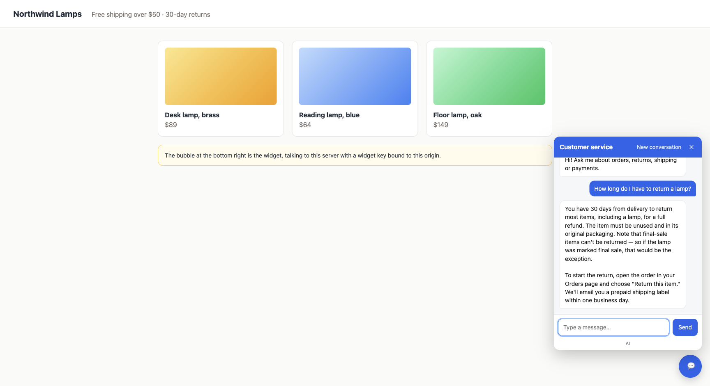

# The web widget

The first channel a customer integrates through (business plan step 2, after
[ADR 002](adr/002-tenancy.md) made tenants exist): one script tag on the customer's own web
page puts a chat bubble in the corner, talking to this deployment with a key bound to that
page's origin.



## Embedding

```html
<script src="https://cs.example.com/widget.js" data-key="cs_…" async></script>
```

| Attribute | Default | What it does |
| --- | --- | --- |
| `data-key` | required | A **widget** key for this tenant, issued in the operations admin with the page's origin |
| `data-host` | the script's own origin | Where `/api/v1/chat/stream` is |
| `data-lang` | the browser's language | `en` or `zh`; the built-in text, and what the assistant is asked in |
| `data-title`, `data-greeting` | per language | The panel's heading and first message |
| `data-position` | `right` | `left` puts the bubble at the bottom left |
| `data-customer-token`, `data-customer-token-key` | none | On a page where the customer is signed in to the tenant's panel: the customer's own panel token, or the localStorage key holding it, forwarded as `X-Customer-Token` so the assistant can read that customer's account ([connectors](connectors.md)) |

The script is served by the application itself (`src/main/resources/static/widget.js`), so
it is versioned with the API it speaks to. `widget-demo.html` is a stand-in shop page for
seeing it work: open `/widget-demo.html?key=<a widget key for that origin>`.

## Keys for browsers

A key in a web page is public: anyone can read it. So a widget key is not a secret key with a
different label; what bounds it is the list of origins it may be used from (ADR 002, and
`V18__widget_keys.sql`):

- Issued with `kind: "widget"` and `origins: ["https://shop.example.com", …]`, each
  `scheme://host[:port]` with no path. A subdomain is another origin; list `www.` and the apex
  both if both serve the page.
- `ApiKeyFilter` refuses a request whose `Origin` is not on the list, or has none, with a
  `403`, and answers CORS (`Access-Control-Allow-Origin` for that one origin, the exposed
  `X-Conversation-Id`) only for an allowed origin. A secret key from a browser is answered
  without CORS headers, which is the browser refusing it on the tenant's behalf.
- The preflight (`OPTIONS`) is answered for any origin without a key: a preflight carries no
  `Authorization` and grants nothing by itself; the actual request is still checked.
- The key is hashed at rest like a secret key, revocable like one, and disabled with its
  tenant. A scraped widget key is no use from another site. What it does not stop is a
  request that forges the `Origin` header outside a browser; the per-conversation token
  budget (`CONVERSATION_TOKEN_BUDGET`) bounds what such a request can spend on one
  conversation, and a per-key rate limit is the next thing to add if a pilot needs it.

`WidgetKeyTest` pins the origin rules and the CORS answer; `TenantApiKeysTest` the
normalisation (`https://Shop.Example.com:443/` is `https://shop.example.com`).

## What it shows, and what it does not

The widget renders `message` events as the answer, breaks a paragraph at a `tool` event
(the seam between a turn's two model calls, see [reliability](reliability.md)), and turns
an `error` event or a failed request into a sentence the customer can act on: still
answering (`409`), conversation limit reached (`429`), unavailable (`503`, `502`), not set up
for this site (`401`, `403`). Retrieval evidence, tool calls and token cost are the
[demo page's](demo-ui.md) business, not a customer's.

The conversation id comes back in `X-Conversation-Id` and is kept in the browser's local
storage per key, so a customer who reloads the page continues the conversation; "New
conversation" forgets it. Everything renders inside a shadow root: the page's styles and the
widget's never meet, and every piece of text is a text node, never markup, so a model answer
cannot inject anything into the customer's page. No markdown is rendered; the assistant's
answers are prose with paragraph breaks.

Not here yet, deliberately: human takeover from the operations admin (a ticket is what the
assistant raises today), file upload, proactive greetings tied to the page, and theming
beyond the position. Each is a decision for the first pilot.

## Verified

Walked on 2026-09-07 against a local build with a real model: the bubble opens, a question
about returns is answered from the corpus, an order question runs the order tool and the
answer breaks a paragraph at the tool seam, both turns land in one conversation of the key's
tenant, a wrong-origin and a missing-origin call are `403`, the preflight is `204`.
